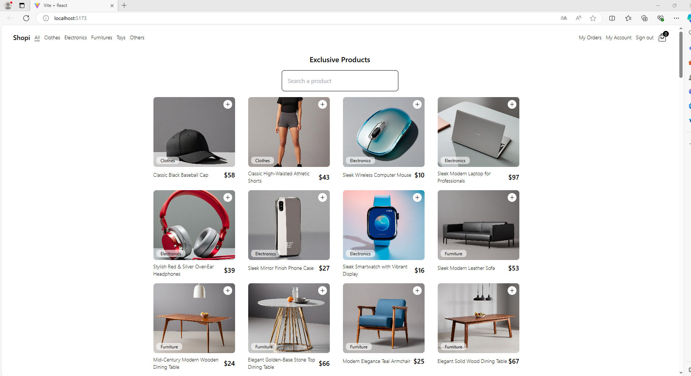
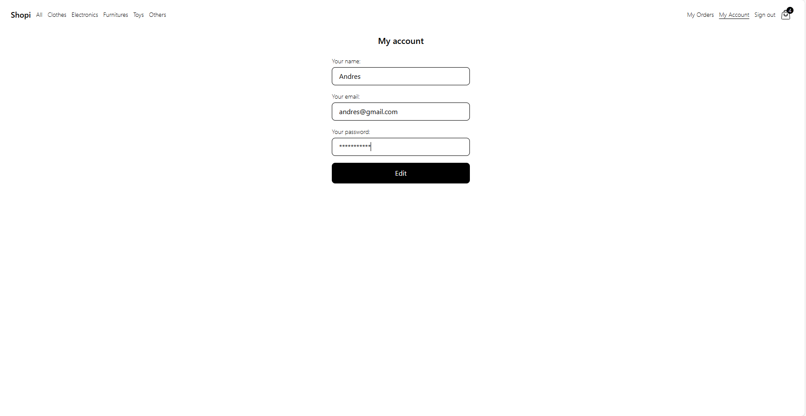

# Proyecto Final de Protalento_2024

## Backend node

Este proyecto fue realizado con Node.js , Nodemon, Express y JWT.

### Como iniciar el proyecto

1. Descargar Codigo fuente, usar el comando git clone.

```sh
git clone https://github.com/Musdado/proyecto_finalpro.git  
```

2. Instalación de librerias
```sh
npm install
```

3. Ejecutar servicio
```sh
npm run start
```

### Frontend

Este frontend fue realizado con React, Javascript, Html y Css.

1. Instalación de librerias
```sh
npm install
```

2. Ejecutar servicio
```sh
npm run dev
```





